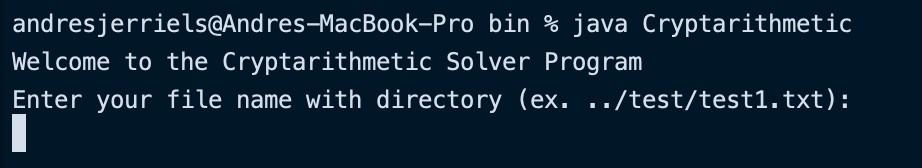
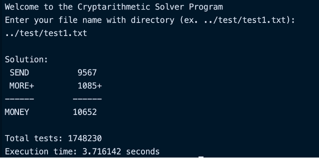

# Tugas Kecil 1 IF2211 Strategi Algoritma
Penyelesaian Cryptarithmetic dengan Algoritma Brute Force

## WELCOME!

Untuk menjalankan program melalui command line, silakan navigasi ke folder bin. Kemudian masukkan:
```
  java Cryptarithmetic
```


Kemudian, masukkan `nama_file.txt` yang berisi persoalan Cryptarithmetic dan program akan menampilkan solusi yang bisa dihasilkan dari persoalan tersebut

Contoh:



